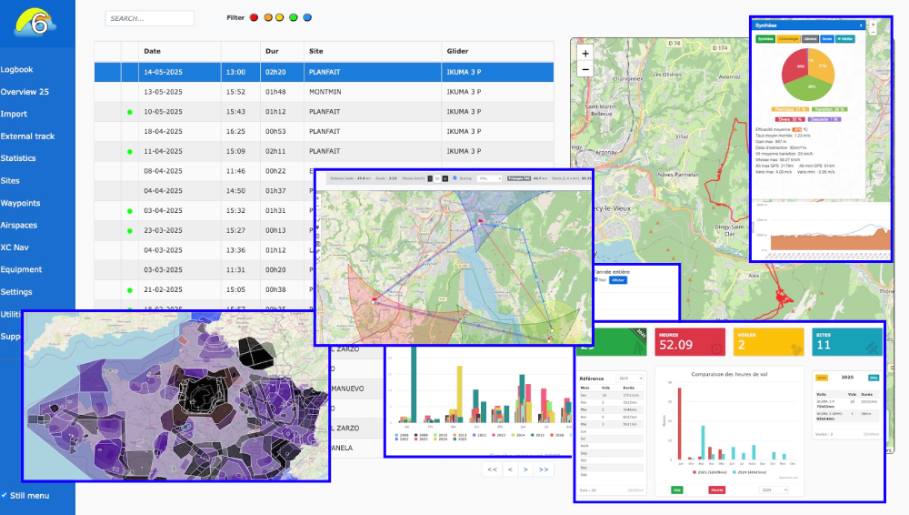

# Logfly
The sixth version of [Logfly](https://github.com/giloutho/Logfly5) will be entirely rewritten in javascript powered by the Electron framework.

Logfly is a log book which stores paragliding flights with GPS tracks or not. It's possible to visualize flights and evaluate the score for online contest. It works on Windows, Mac and Linux. All [Logfly5 functions](https://github.com/giloutho/Logfly5#readme) will be fully implemented in javascript

### Built With
* [Electron](https://www.electronjs.org/)
* [Electron-forge](https://github.com/electron-userland/electron-forge)
* [Better-sqlite3](https://github.com/JoshuaWise/better-sqlite3)
* [Leaflet](https://github.com/Leaflet/Leaflet)

### Credits
- [Tom Payne](https://github.com/twpayne) the first paragliding softwares developer
- [Tobias Bieniek](https://github.com/Turbo87/igc-parser) for his great igc parser
- [Momtchil Momtchev](https://github.com/mmomtchev) for the fantastic scoring module
- [Torben Brams](https://github.com/tbrams/OpenAirJS) for the OpenAir parser 
- [Victor Berchet](https://github.com/vicb/flyXC) for his great project FlyXC
- [Sylvain Pasutto](https://github.com/spasutto/test-igc-xc-score/tree/master) for his map point and click score tool 